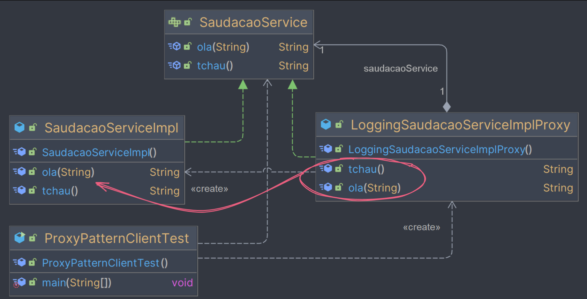
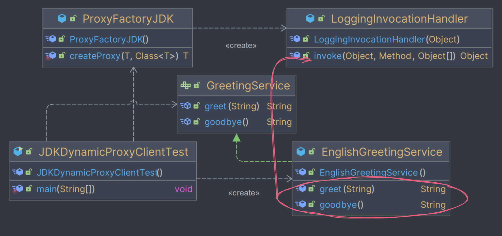
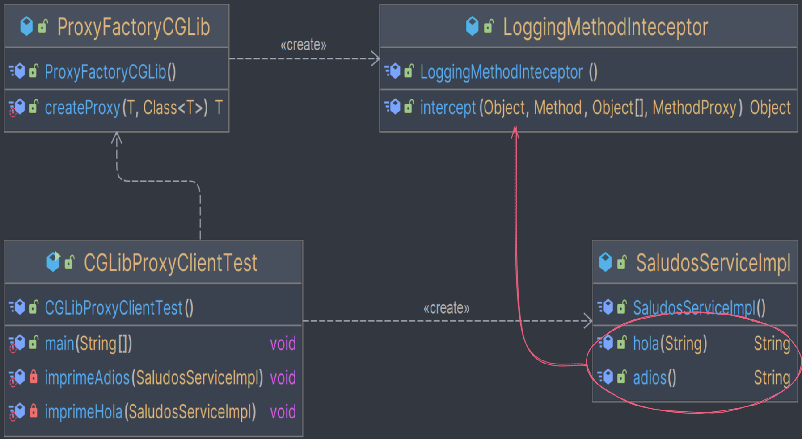

####

<details>
  <summary><i>Proxy</i></summary>
<ol>
<ln><details>
    <summary>Proxy Estático</summary>
<ol>

### Cenário

Temos a seguinte interface que defini os métodos de saudação:

- ola
- tchau

> SaudacaoService
>```java
> public interface SaudacaoService {  
>    String ola(String name);  
>    String tchau();  
>}
> ```

E temos a classe que implementa a interface:
> SaudacaoServiceImpl
>```java
>public class SaudacaoServiceImpl implements SaudacaoService {  
>    @Override  
>    public String ola(String name) {  
>        return "Olá, " + name + "!";  
>    }  
> 
>    @Override  
>    public String tchau() {  
>        return "Tchau!!";  
>    }  
>}
>```

### Problema

Se quisermos controlar o acesso/alterar/estender o comportamento destes métodos, como adicionar informações de Log no
console, antes e depois da execução dos métodos sem alterar diretamente a implementação da classe `SaudacaoServiceImpl`,
ou de qualquer outra classe hipotética que não tenhamos acesso, podemos implementar um proxy.

### Solução

O Proxy Pattern consiste em:

- Tirar proveito da mesma interface do objeto em questão, fazendo sua implementação
- Instanciar e delegar à classe em questão a execução do método de interesse
- adicionar lógica antes ou depois da chamada do método de interesse
- Ou alterar o retorno desta delegação

> LoggingSaudacaoServiceImplProxy
>```java
>public class LoggingSaudacaoServiceImplProxy implements SaudacaoService {  
>    private SaudacaoService saudacaoService = new SaudacaoServiceImpl();  
>    @Override  
>    public String ola(String name) {  
>        System.out.println("Método ola foi chamado com o arg: " + name);  
>        String ola = saudacaoService.ola(name);  
>        System.out.println("Método ola devolveu " + ola);  
>        return ola;  
>    }  
>  
>    @Override  
>    public String tchau() {  
>        System.out.println("Método tchau foi chamado com o arg: \"null\"");  
>        String tchau = saudacaoService.tchau();  
>        System.out.println("Método tchau devolveu " + tchau);  
>        return tchau;  
>    }  
>}
>```

### Teste

> ProxyPatternClientTest
>```java
>public class ProxyPatternClientTest {  
>    public static void main(String[] args) {  
>  
>        SaudacaoService proxyService = new LoggingSaudacaoServiceImplProxy();  
>  
>        System.out.println("-------------------------------");  
>        System.out.println("Proxy: ");  
>        System.out.println(proxyService.ola("Mundo"));  
>        System.out.println("-------------------------------");  
>        System.out.println("Proxy: ");  
>        System.out.println(proxyService.tchau());  
>        System.out.println("-------------------------------");  
>    }  
>}
>```

### Saída

> Console
>```java
>-------------------------------
>Proxy: 
>Método ola foi chamado com o arg: Mundo
>Método ola devolveu Olá, Mundo!
>Olá, Mundo!
>-------------------------------
>Proxy: 
>Método tchau foi chamado com o arg: "null"
>Método tchau devolveu Tchau!!
>Tchau!!
>-------------------------------
>```

### Diagrama



### Conclusão

Agora toda vez que na classe `ProxyPatternClientTest` chamarmos os métodos `ola` ou `tchau` da
Interface `SaudacaoService`, serão invocados os métodos da classe referenciada `LoggingSaudacaoServiceImplProxy`.

Desta forma nos dando a oportunidade de estender/modificar/alterar o comportamento da implementação da classe
de `EnglishGreetingService`.

</ol>
</details></ln>

####
___

<ln><details>
<summary>JDK Dynamic Proxy</summary>
<ol>

### Problema

> ❗️Aumento no número de classes
> 
> De acordo com a implementação Proxy Pattern - Estático (com interface), toda vez que
> precisarmos de um proxy para a `classeX`, precisaremos:
>
>- caso não exista uma interface sendo implementada e seja possível alterar a classe `classeX`:
   >	- faze-la implementar uma nova interface
>- criar uma nova classe `proxyX` para servir de proxy
>- fazê-la implementar a mesma interface da `classeX`
>- ao implementar a sobrescrita do método, delegar a instância da `classeX` a execução de seu método
>- e adicionar o comportamento desejado antes ou depois de delegar o método a `classeX`
>
> > 🚧 Se tivermos N classes para aplicar um comportamento, teremos N proxies implementados. E isso é um problema!

### Cenário

Temos a seguinte interface que define os métodos de saudações:
>GreetingService
>```java
>public interface GreetingService {  
>    String greet(String name);  
>    String goodbye();  
>}
>```

E temos a classe que implementa a interface:
>EnglishGreetingService
>```java
>public class EnglishGreetingService implements GreetingService {  
>    @Override  
>    public String greet(String name) {  
>        return "Hello, " + name + "!";  
>    }  
>  
>    @Override  
>    public String goodbye() {  
>        return "Goodbye!!!";  
>    }  
>}
>```

Queremos adicionar **informações de Log no console**, antes e depois da execução dos métodos sem alterar diretamente a implementação da classe `EnglishGreetingService`, ou de qualquer outra classe hipotética que não tenhamos acesso.

### Solução

Dado que queremos evitar implementar um proxy novo para cada classe, o Java já disponibiliza uma maneira dinâmica (programática) de criarmos proxies. Porém para isso utilizaremos:
- Reflection:
    - `InvocationHandler` (para controlar o acesso aos métodos)
    - `Proxy` (Objeto que representa o objeto original)

E precisaremos:
- Implementar um `InvocationHandler` para a funcionalidade de Log
- Criar uma `ProxyFactoryJDK` que nos proverá um proxy para qualquer objeto que possua uma interface:
    - **Vamos criar** uma factory de um Proxy (`java.lang.reflect.Proxy`) da biblioteca Reflection,  que trabalham com:
        - *Proxy*
            - *InvocationHandler*
            - *ClassLoader*
            - *Interface em Comum com o objeto de interesse*

> LoggingInvocationHandler
>```java
>public class LoggingInvocationHandler implements InvocationHandler {  
>    private Object target;  
>  
>    public LoggingInvocationHandler(Object target) {  
>        this.target = target;  
>    }  
>  
>    @Override  
>    public Object invoke(Object proxy, Method method, Object[] args) throws Throwable {  
>        System.out.println("Method " + method.getName()+ " was called with args: " +  
>                (args != null?Arrays.toString(args):"null")  
>        );  
>        Object result = method.invoke(target, args);  
>        System.out.println(  
>                "Method " + method.getName() + " returns: " + result  
>        );  
>        return result;  
>    }  
>}
>```

> ProxyFactoryJDK
>```java
>public class ProxyFactoryJDK {  
>    public static <T> T createProxy(T target, Class<T> interfaceClass) {  
>        return (T) Proxy.newProxyInstance(  
>                interfaceClass.getClassLoader(),  
>                new Class<?>[]{interfaceClass},  
>                new LoggingInvocationHandler(target));  
>    }  
>}
>```


### Teste

Desta forma poderemos criar proxies de qualquer classe que possua uma interface. Para validar o conceito, fizemos o teste tanto com:
- A classe e interface do caso de uso atual ("Hello, World!")
- Quanto a classe e interface do caso de uso Proxy Pattern - Estático (com interface) - ("Olá, Mundo!")

>Classe de Teste
>```java
>public class JDKDynamicProxyClientTest {  
>  
>    public static void main(String[] args) {  
>        GreetingService proxyService = ProxyFactoryJDK.createProxy(new EnglishGreetingService(), GreetingService.class);  
>        System.out.println("-------------------------------");  
>        System.out.println("Proxy: ");  
>        System.out.println(proxyService.greet("World"));  
>        System.out.println("-------------------------------");  
>        System.out.println("Proxy: ");  
>        System.out.println(proxyService.goodbye());  
>        System.out.println("-------------------------------");  
>  
>        SaudacaoService saudacaoService = ProxyFactoryJDK.createProxy(new SaudacaoServiceImpl(), SaudacaoService.class);  
>        System.out.println("-------------------------------");  
>        System.out.println("Proxy: ");  
>        System.out.println(saudacaoService.ola("Mundo"));  
>        System.out.println("-------------------------------");  
>        System.out.println("Proxy: ");  
>        System.out.println(saudacaoService.tchau());  
>        System.out.println("-------------------------------");  
>    }  
>}
>```

### Saída

>Console
>```java
>-------------------------------
>Proxy: 
>Method greet was called with args: [World]
>Method greet returns: Hello, World!
>Hello, World!
>-------------------------------
>Proxy: 
>Method goodbye was called with args: null
>Method goodbye returns: Goodbye!!!
>Goodbye!!!
>-------------------------------
>-------------------------------
>Proxy: 
>Method ola was called with args: [Mundo]
>Method ola returns: Olá, Mundo!
>Olá, Mundo!
>-------------------------------
>Proxy: 
>Method tchau was called with args: null
>Method tchau returns: Tchau!!
>Tchau!!
>-------------------------------
>```

### Diagrama

>


### Conclusão

Agora toda vez que na classe `JDKDynamicProxyClient` chamarmos os métodos `greet` ou `goodbye` da Interface `GreetingService` serão invocados através do método ==**`invoke`**== da classe `LoggingInvocationHandler`.

Desta forma nos dando a oportunidade de estender/modificar/alterar o comportamento da implementação da classe de `EnglishGreetingService`.

</ol>
</details></ln>


####
___

<ln><details>
<summary>CGLib Proxy Pattern</summary>
<ol>

>❗️Descreva abaixo o problema identificado
> 
> De acordo com as implementações anteriormente abordadas, Proxy Pattern - Estático (com interface) e JDK Dynamic Proxy, toda vez que precisarmos de um proxy para uma `classeX`, precisaremos que a classe implemente uma interface.
> > 🚧 Ambas implementações exigem uma interface
> > O problema é que nem sempre a nossa `classeX` estará implementando uma interface. E nem sempre teremos acesso para editar a classe para fazê-la implementar uma interface para o propósito de criar o nosso proxy.
>


### Cenário

Diferente das implementações anteriores Proxy Pattern - Estático (com interface) e CGLib Proxy, temos a classe real que **não implementa nenhuma interface**, e possui os métodos:
- hola
- adios

> SaludosServiceImpl
>```java
>public class SaludosServiceImpl {  
>    public String hola(String name) {  
>        return "Hola " + name + "!";  
>    }  
>  
>    public String adios() {  
>        return "Adiós!!";  
>    }  
>}
>```


### Solução

Desta vez:
- **vamos criar** uma factory de um proxy da CGLib e trabalha com:
    - Enhancer (Proxy CGLib)
        - MethodInterceptor
        - Reflection (de forma mais abstraída)


> ProxyFactoryCGLib  
> Cria um Interceptor do tipo CGLib `MethodInterceptor`
>```java
>public class LoggingMethodInteceptor implements MethodInterceptor {  
>    @Override  
>    public Object intercept(Object obj, Method method, Object[] args, MethodProxy methodProxy) throws Throwable {  
>        System.out.println("El método " + method.getName()+ " fue llamado com los args: " +  
>                (args != null? Arrays.toString(args):"null")  
>        );  
>        Object result = methodProxy.invokeSuper(obj, args);  
>        System.out.println(  
>                "El método " + method.getName() + " devolvió: " + result  
>        );  
>        return result;  
>    }  
>}
>```


> ProxyFactoryCGLib
> Devolve um Proxy do tipo CGLib `Enhancer`
>```java
>public class ProxyFactoryCGLib {  
>    public static <T> T createProxy(T target, Class<T> superclassType) {  
>        Enhancer enhancer = new Enhancer();  
>        enhancer.setSuperclass(superclassType);  
>        enhancer.setCallback(new LoggingMethodInteceptor());  
>        return (T) enhancer.create();  
>    }  
>}
>```


### Teste

> Classe de Teste
>```java
>public class CGLibProxyClientTest {  
>    public static void main(String[] args) {  
>        SaludosServiceImpl greetingServicePoxy = ProxyFactoryCGLib.createProxy(new SaludosServiceImpl(), SaludosServiceImpl.class);  
>  
>        System.out.println("-------------------------------");  
>        System.out.println("Proxy: ");  
>        System.out.println(greetingServicePoxy.hola("Mundo"));  
>        System.out.println("-------------------------------");  
>        System.out.println("Proxy: ");  
>        System.out.println(greetingServicePoxy.adios());  
>        System.out.println("-------------------------------");  
>    }  
>}
>```


### Saída

> Console
> ```java
> -------------------------------
> Proxy: 
> El método hola fue llamado com los args: [Mundo]
> El método hola devolvió: Hola Mundo!
> Hola Mundo!
> -------------------------------
> Proxy: 
> El método adios fue llamado com los args: []
> El método adios devolvió: Adiós!!
> Adiós!!
> -------------------------------
> ```

### Diagrama

> Diagrama
> 

### Conclusão

Agora toda vez que na classe `CGLibProxyClientTest` chamarmos os métodos `hola` ou `adios` da instancia de `SaludosServiceImpl` a chamada será interceptada pelo método `intercept` da classe `LoggingMethodInterceptor`.

Desta forma nos dando a oportunidade de estender/modificar/alterar o comportamento da classe de `SaludosServiceImpl`.


</ol>
</details></ln>

####
___
